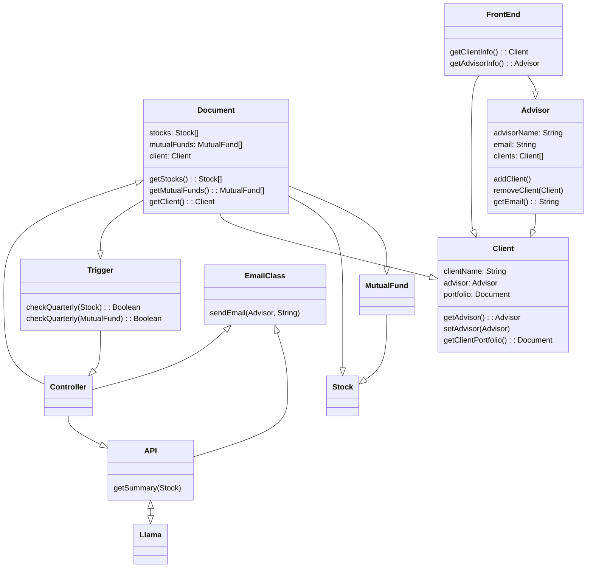
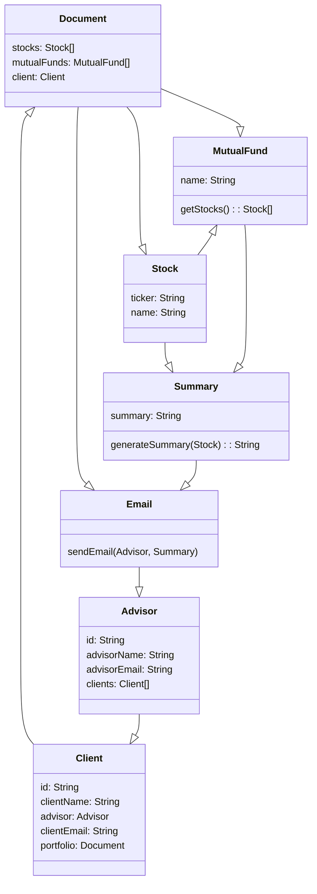

##**Tech Stack:** Nothing changed from original submission.
##**Architecture:** Changed reference from LLama AI to Gemini and Alpha Vantage
## **Old:**
- 
## **New:**
- 

##**Domain Model:** Editted based on instructor feedback, removing references to APIs / Controllers. 
##**Old:**

## **New:**

## **Use Cases:** Replaced all references to Llama with references to Gemini / Alpha Vantage

## **Business Requirements:** Updated BR1 based on instructor feedback.
**Old:** A generative AI will summarize information and update the client based on their needs.
**New:** Keep Advisors updated on changes within their clientelles investments so that they can more easily inform their client about it.
