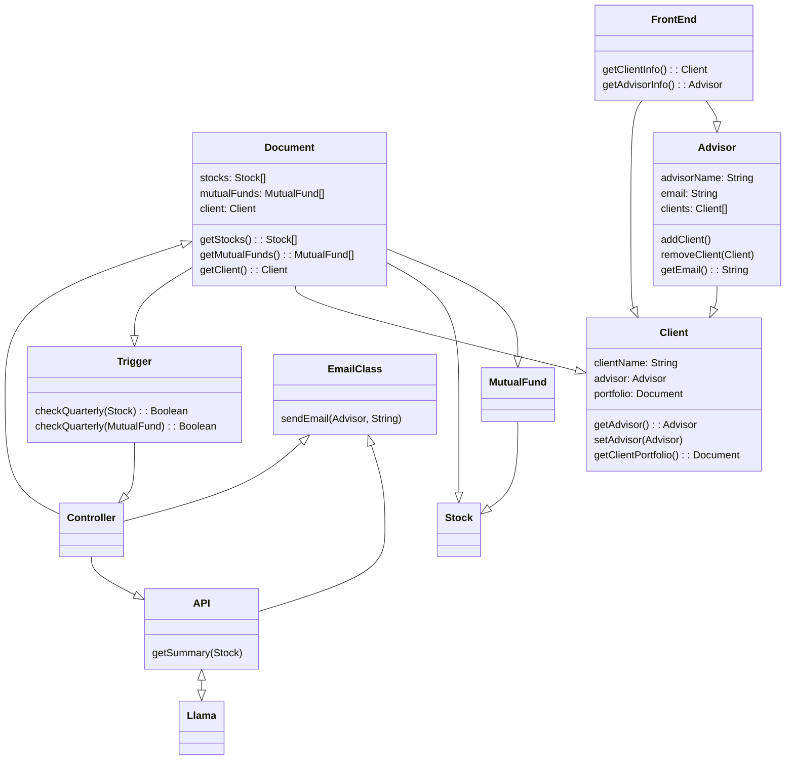
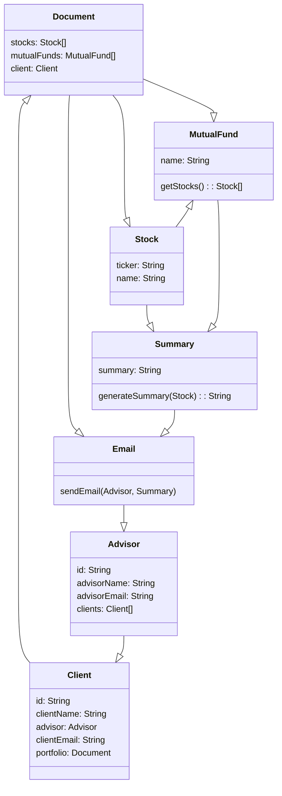

## **Architecture:** Changed reference from LLama AI to Gemini and Alpha Vantage
## **Old:**
- 
## **New:**
- 

## **Domain Model:** Editted based on instructor feedback, removing references to APIs / Controllers. 
## **Old:**

## **New:**

## **Use Cases:** Replaced all references to Llama with references to Gemini / Alpha Vantage

## **Business Requirements:** Updated BR1 based on instructor feedback.
- **Old:** A generative AI will summarize information and update the client based on their needs.
- **New:** Keep Advisors updated on changes within their clientelles investments so that they can more easily inform their client about it.

## **Tech Stack:** Replaced reference to Llama with gemini.  Added reference to python.
- **Old:**
- Llama
  - [Llama](https://huggingface.co/meta-llama/Llama-3.2-3B)
  - A collection of pretrained generative models. This was the AI model recommended by our mentor for the use as our generative AI.
- **New:**
- Gemini
  - [Gemini](https://gemini.google.com/)
  - A collection of pretrained generative models. This was the AI model recommended by our client for the use as our generative AI.
- .Net and Python

## **Functional Requirements: ** Swapped llama with gemini.  Split requirements based on instructor feedback.
Requirements.md

- **Old:**
- FR1: Advisor management
        - retrieve advisor information high
        - create new advisor medium
        - delete advisor medium
        - list of clients linked to advisor high
  - UC2 
- FR2: Client management
        - retrieve client information and link to portfolio high
        - create new clients medium
        - delete clients medium
  - UC1
- FR3: Document management
        - retreieve advisor email high
        - retrieve quarterly statements for client and advisor high
        - trigger when new documents are available high
  - UC1
- FR4: Email notification
        - retrieve advisor email medium
        - generate and send emails to advisor when new documents are available high
  - UC4
- FR5: API integration
        - system retrieve summary of stock information by external AI API medium
        - request from controller and fetch data high
  - UC1
- FR6: trigger
        - system checks for quarterly documents high
        - system initaite the process of notifying relevent parties when new document is available high
  - UC4
- FR7: Controller
        - system handling communication between UI, Advisor, client, and document, and API high
  - UC1
- FR8: frontend interface
        - frontend prompt the user for advisor and client high
        - system allowing the user to trigger document checks and sends emails through interface high
  - UC4
- FR9: Llama AI
        - system must integrate with llama AI to retrieve relevent stock summaries based on inputs from API medium
  - UC3
- **New:**
- FR1: Advisor management
        - retrieve advisor information (and their clients): high priority
  - UC2 
- FR2: Client management
        - retrieve client information and link to portfolio: high priority
  - UC1
- FR3: Document management
        - retrieve quarterly statements for client and advisor: high priority
  - UC1
- FR4: Email notification
        - generate and send emails to advisor when new documents are available: high priority
  - UC4
- FR5: API integration
        - system retrieve summary of stock information by external AI API: medium priority
  - UC1
- FR6: Trigger
        - system initaites the process of notifying relevent parties when new quarterly document is available: high priority
  - UC4
- FR7: Controller
        - system handling communication between UI, Advisor, client, and document, and API: high priority
  - UC1
- FR8: Frontend interface
        - user can select a number of stocks to gain informatiom on: high priority
  - UC4
- FR9: Gemini AI
        - system must integrate with gemini AI to retrieve relevent stock summaries based on inputs from API: high priority
  - UC3
 
