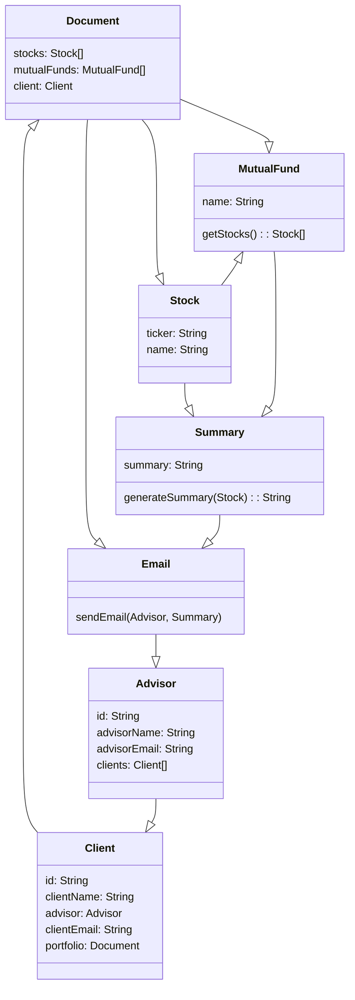

# Domain Model

## Classes
### Advisor
- A financial advisor at the company.  Can potentially have many clients.
### Client
- A client of the advising company.  Will only have one Advisor.
### Email
- A summary of the stock data that is emailed to the advisor.  It is only sent to the advisor, not the client.
### Document
- A collection of portfolio related assets that pertain to the client.  Would include Stocks and Mutual Funds, and a client and advisor identifier.
### Stock
- A financial Asset that is owned by the client, and managed by the advisor.
### Mutual Fund
- A collection of stocks/ bonds.  Like stocks, they are owned by the client but are managed by the advisor.
### Summary
- A summary of the changes to a stock/mutual fund.  The summary is generated through a combined use of stock data and generative AI, and then emailed to the financial advisor.
