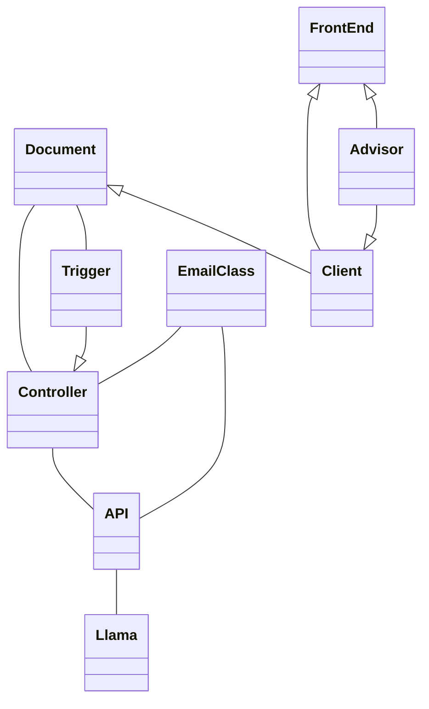

# Domain Model

## Classes
### AdvisorInformation
- Retrieves the advisor information and matches it to their clients
### ClientInformation
- Retrieves the client information and matches it to their portfolio
### Controller
- Processes requests between all the other aspects of the domain
### API
- Processes requests between the Controller and the Llama AI
### FrontEnd
- An admin terminal to help test the API
### EmailClass
- Summarizes the information from the AI prompt and then sends it as an email
### Trigger
- Checks if new quarterly statements are out
### Llama 
- Generative AI tool
